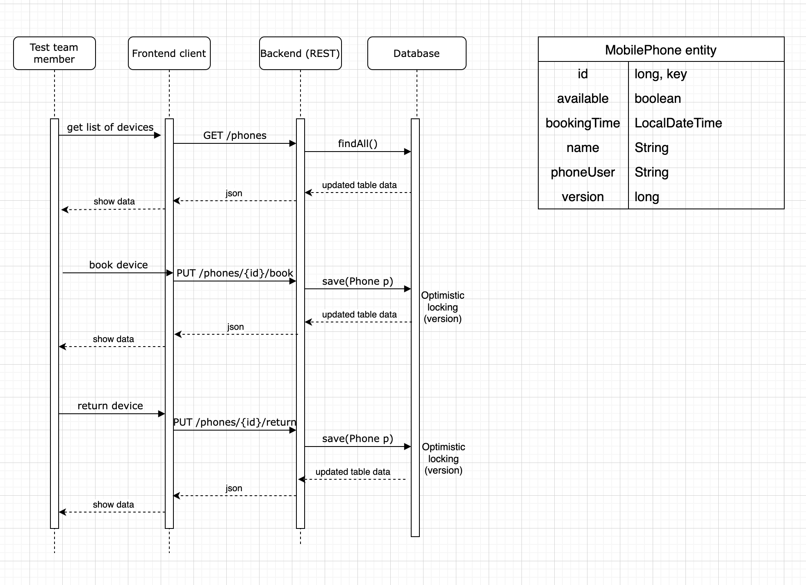

Solution was implemented as Spring boot web application that expose REST api to list, book and return mobile phone.

From the task description I see that there can be 2 devices with the same name but I decided to make it as simple as possible and just added two records into database.
With more time I would add handling of count of devices.

In order not to allow two users book/return the same device at the same time I've used Optimistic locking using MobilePhone.version attribute (DB is checking that).
In particular task in my opinion we do not need to use Pessimistic locking.

For testing purposes I added BookingServiceTest. With more time we can also add integration tests.

UML diagram:
